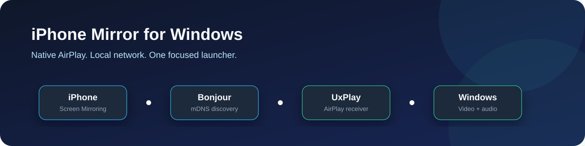
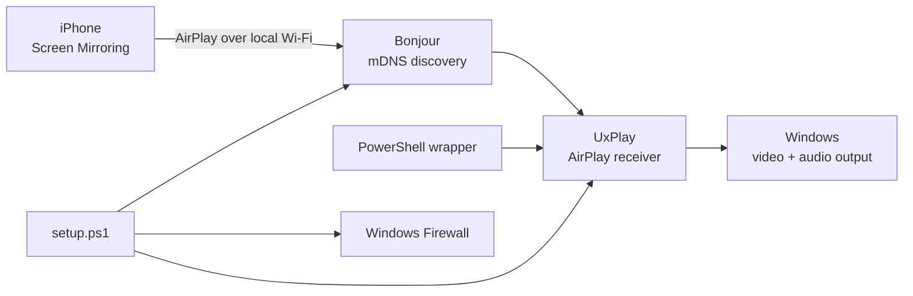

# iPhone Mirror for Windows



[](https://www.microsoft.com/windows)
[](https://learn.microsoft.com/powershell/)
[](LICENSE)
[](https://www.apple.com/airplay/)

A clean Windows launcher for mirroring an iPhone through the native iOS
**Control Center -> Screen Mirroring** menu. No iPhone app or cable is needed.

This project is a practical wrapper around [UxPlay](https://github.com/FDH2/UxPlay)
and the Windows integration work from [AirPlayPC](https://github.com/gbulog/pcairplay).
The wrapper makes the common path easier to understand while keeping upstream
credit and licensing visible.

## What You Get

- A named PC receiver that appears in iPhone Screen Mirroring
- Sensible 1080p / 60 FPS defaults for demos
- Optional PIN, fullscreen, A/V sync, capture-safe mode, and software decoding
- Setup and diagnostics through PowerShell
- Local logs under `%LOCALAPPDATA%\pcairplay`
- No telemetry or cloud relay

## Quick Start

1. Install [Apple Bonjour](https://support.apple.com/kb/DL999) if it is not
   already installed through iTunes or Apple Devices.
2. Clone this repository.
3. Open **PowerShell as Administrator** in the repository folder.
4. Run:

```powershell
Set-ExecutionPolicy -Scope Process Bypass
.\setup.ps1
.\Screen Mirroring for iPhone in Windows\Mirror-iPhone.ps1
```

5. On the iPhone, open Control Center, tap **Screen Mirroring**, and choose
   `My PC`.

After setup, normal sessions can run without Administrator privileges:

```powershell
.\Screen Mirroring for iPhone in Windows\Mirror-iPhone.ps1 -Name "My Laptop"
```

## Useful Modes

```powershell
# Presentation setup
.\Screen Mirroring for iPhone in Windows\Mirror-iPhone.ps1 `
  -Name "Presentation PC" -PIN -Fullscreen

# Better lip-sync for video playback
.\Screen Mirroring for iPhone in Windows\Mirror-iPhone.ps1 -Sync

# Reduce network and decoder load
.\Screen Mirroring for iPhone in Windows\Mirror-iPhone.ps1 -Fps 30

# Make the mirror window easier to capture in Teams, Zoom, or OBS
.\Screen Mirroring for iPhone in Windows\Mirror-iPhone.ps1 -ShareSafe
```

Other available switches: `-NoAudio`, `-SoftwareDecode`, `-EngineDebug`, and
`-SkipSetup`.

## Architecture



The wrapper owns the user-facing launch experience. UxPlay owns the AirPlay
protocol implementation. `setup.ps1` installs the pinned Windows receiver,
checks Bonjour, and configures the required local firewall rules.

## Troubleshooting

- **PC does not appear:** confirm Bonjour is running and both devices are on
  the same Wi-Fi network.
- **Setup fails:** rerun `setup.ps1` from an elevated PowerShell window.
- **Black video:** try `-SoftwareDecode`.
- **Black Teams/Zoom capture:** try `-ShareSafe`.
- **Need diagnostics:** run `.doctor.ps1` from the repository root.

## Project Status

This is a Windows-focused convenience layer around established open-source
components. Test it on your own hardware and network before relying on it for
a live presentation. DRM-protected services may intentionally refuse mirroring.

## Credits and Licensing

The wrapper scripts are MIT licensed. UxPlay is maintained by
[FDH2](https://github.com/FDH2/UxPlay) under GPL-3.0. The Windows distribution
and integration patterns come from [leapbtw/uxplay-windows](https://github.com/leapbtw/uxplay-windows)
and [gbulog/pcairplay](https://github.com/gbulog/pcairplay). See
[THIRD-PARTY-NOTICES.md](Screen%20Mirroring%20for%20iPhone%20in%20Windows/THIRD-PARTY-NOTICES.md)
before redistributing a packaged build.

## License

The wrapper is available under the [MIT License](LICENSE). Third-party
components retain their original licenses.
